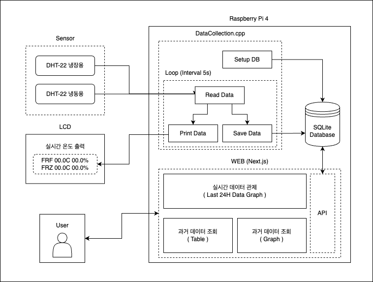

# GMP Temperature Checker

## 프로젝트 개요
이 프로젝트는 라즈베리 파이 4를 이용하여 냉장고 및 냉동고의 실시간 온습도를 모니터링하는 시스템입니다. 두 개의 DHT-22 센서를 사용하여 실시간 데이터를 수집하고, SQLite 데이터베이스에 저장하며, 웹 인터페이스(Next.js)를 통해 사용자는 과거 데이터를 조회하거나 실시간 온습도를 확인할 수 있습니다. 

## 주요 기능
- **온습도 측정**: DHT-22 센서를 사용하여 냉장고와 냉동고의 온습도를 5초 간격으로 측정합니다.
- **데이터 저장**: 수집된 데이터를 SQLite 데이터베이스에 저장합니다.
- **LCD 출력**: 실시간으로 LCD에 냉장고와 냉동고의 온습도를 출력합니다.
- **웹 UI 제공**: Next.js로 개발된 웹 인터페이스를 통해 실시간 및 과거 데이터를 그래프와 테이블로 조회할 수 있습니다.

## 시스템 아키텍처
시스템은 아래와 같은 컴포넌트로 구성됩니다:



- **Sensor (DHT-22)**: 냉장용, 냉동용 두 개의 센서가 각각의 데이터를 수집합니다.
- **LCD**: 실시간 온도 및 습도를 표시합니다.
- **Raspberry Pi 4**: 메인 처리 장치로, 센서 데이터 수집 및 저장 그리고 웹 서버 역할을 담당합니다.
  - **DataCollection.cpp**: 센서 데이터를 주기적으로 읽고 데이터베이스에 저장하는 프로그램입니다.
  - **SQLite Database**: 센서에서 수집된 데이터를 저장하는 경량 데이터베이스입니다.
  - **웹 인터페이스 (Next.js)**: API를 통해 실시간 및 과거 데이터를 조회할 수 있는 UI를 제공합니다.

## 설치 및 실행 방법

1. **라즈베리 파이 설정**
- WiringPi를 설치합니다:
    ```bash
    sudo apt-get install wiringpi
    ```
- SQLite3 설치:
    ```bash
    sudo apt-get install sqlite3
    ```

2. **프로젝트 클론**
   ```bash
   git clone <repository-url>
   cd GMP_Temperature_Checker
   ```

3. **필요한 라이브러리 설치**
- C++ 프로그램을 컴파일하기 위해 필요한 라이브러리 설치:
    ```bash
    sudo apt-get install g++
    sudo apt-get install libsqlite3-dev
    ```

4. **프로그램 빌드 및 실행**
- `DataCollection.cpp` 파일을 컴파일하고 실행합니다:
    ```bash
    g++ -o DataCollection DataCollection.cpp -lwiringPi -lsqlite3 -lpthread
    ./DataCollection
    ```

5. **Next.js 설치 및 실행**
- 웹 인터페이스를 실행하기 위해 Next.js를 설정합니다:
    ```bash
    cd web
    npm install
    npm run dev
    ```

## DataCollectionLCD.cpp 주요 기능

- **센서 데이터 읽기**: DHT-22 센서에서 주기적으로 데이터를 읽고, 읽은 값을 처리합니다. 
- **LCD 출력**: LCD에 냉장고 및 냉동고의 온도와 습도를 실시간으로 출력합니다.
- **SQLite 데이터베이스에 저장**: 온도와 습도 데이터를 `ThermoHygrometer.db`에 저장합니다.

## 데이터베이스 구조

SQLite 데이터베이스는 다음과 같은 구조를 가집니다:
- **timestamp**: 데이터가 수집된 시간
- **refrigerator_temp**: 냉장고 온도
- **refrigerator_humid**: 냉장고 습도
- **freezer_temp**: 냉동고 온도
- **freezer_humid**: 냉동고 습도

## 웹 UI 기능

웹 인터페이스는 Next.js로 개발되었으며, 다음과 같은 기능을 제공합니다:
- **실시간 데이터 시각화**: 최근 24시간 동안의 데이터를 그래프로 시각화하여 보여줍니다.
- **과거 데이터 조회**: 테이블 형식으로 과거의 데이터를 조회할 수 있습니다.

## 기여 방법

이 프로젝트에 기여하고 싶다면, Pull Request를 제출하거나 이슈를 등록해 주세요.

## 라이선스

이 프로젝트는 MIT 라이선스 하에 배포됩니다. 자세한 내용은 [LICENSE](./LICENSE) 파일을 참조하세요.